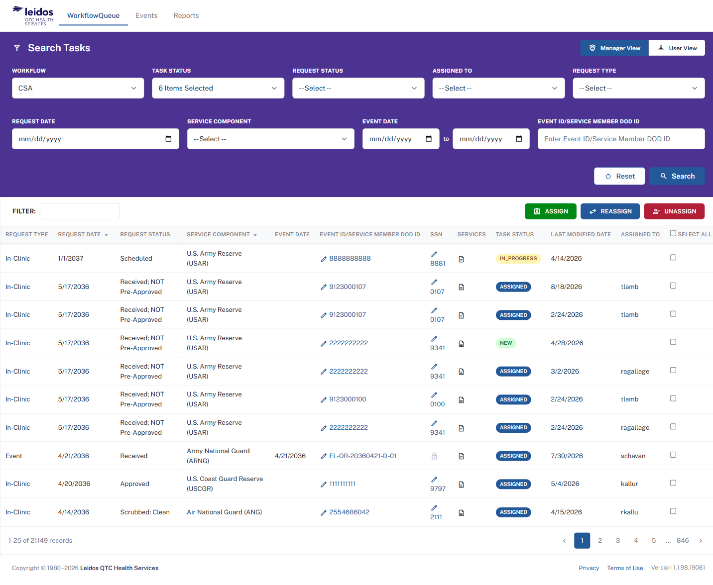
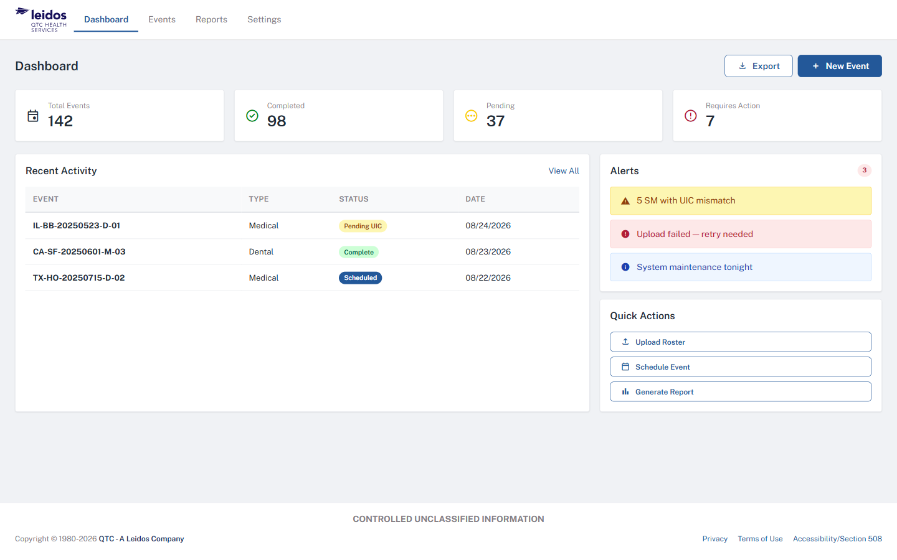
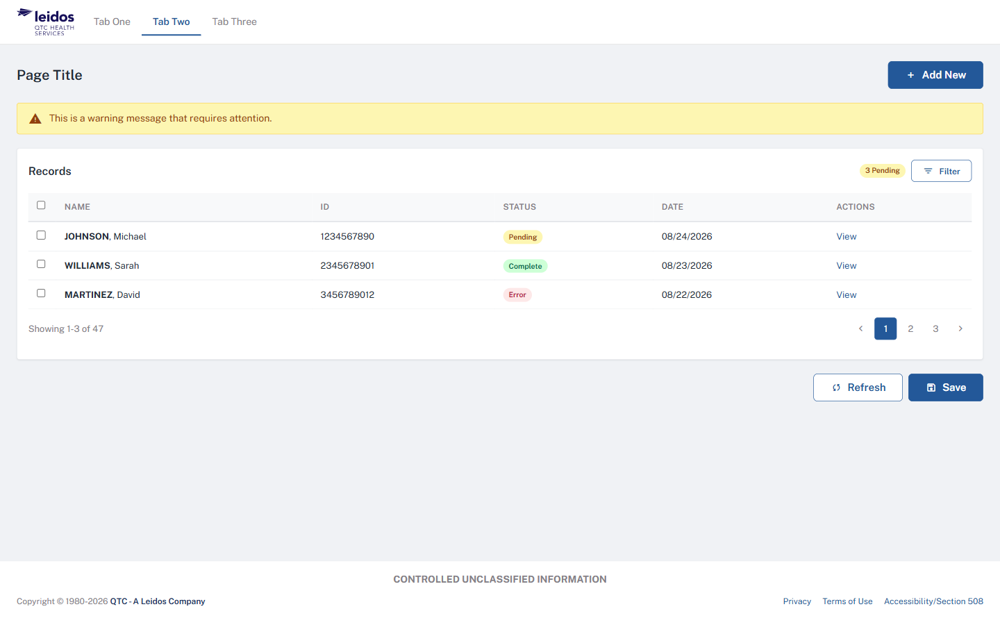
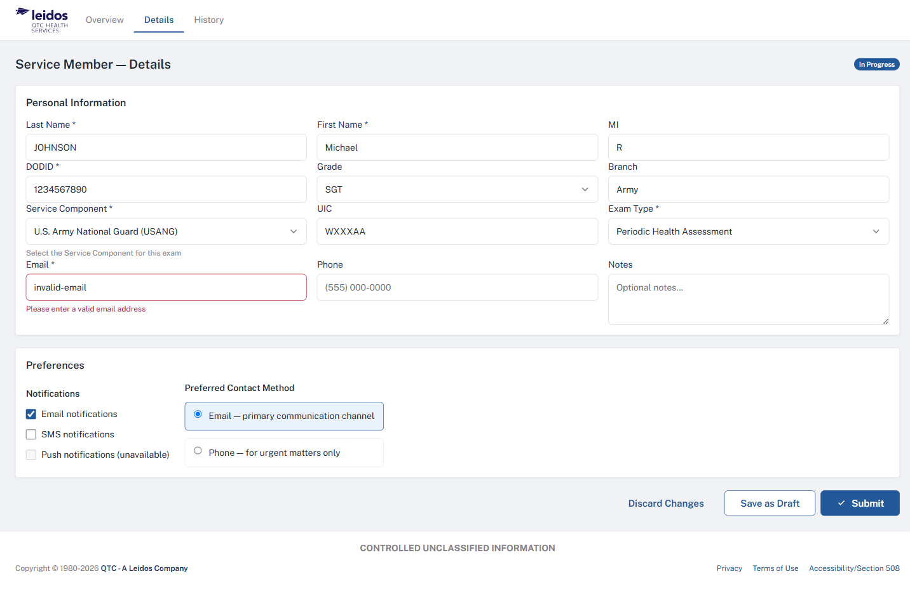
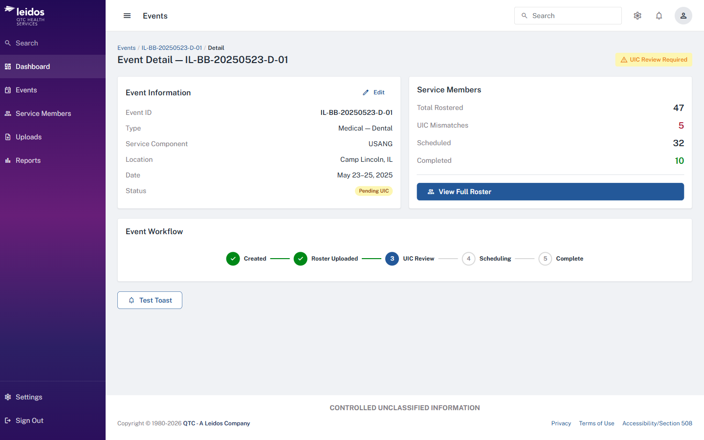
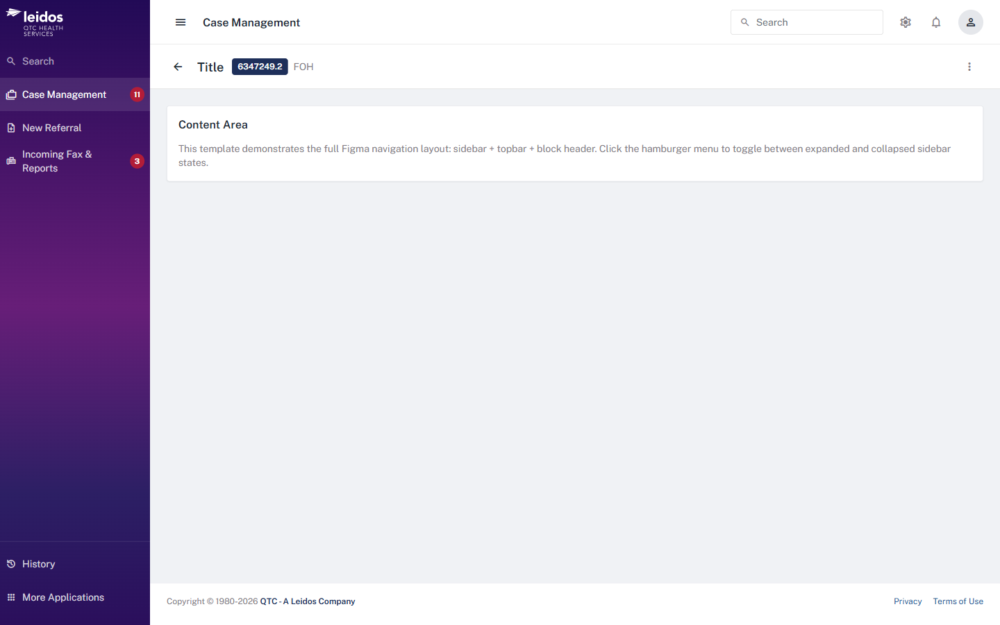
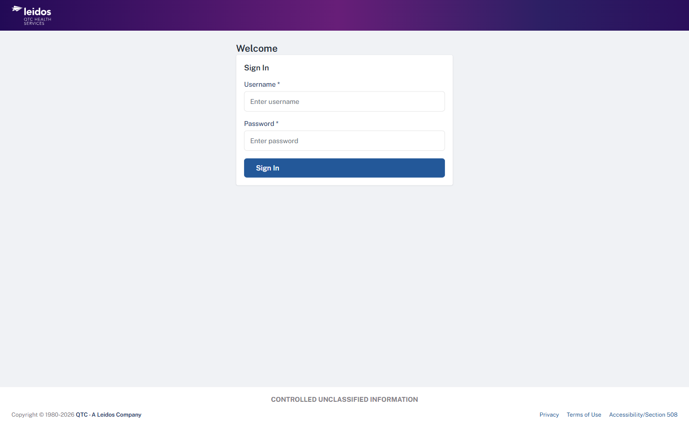
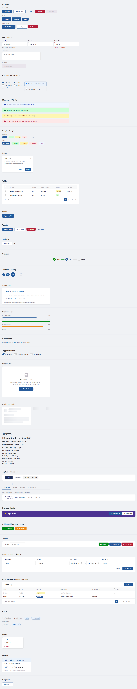

# Unity UI Kit — Introduction for the Design Team

## What is this?

The **Unity UI Kit** is a CSS framework + AI skill that lets anyone generate production-fidelity HTML mockups and prototypes using the exact same components, tokens, and patterns from our Figma library — without writing custom CSS.

**Figma Library:** [Unity UI Kit v1.0](https://www.figma.com/design/4k8jrWQQxHYeDseVQzZWGe/Unity-UI-Kit-v1.0)
**GitHub:** [skqtcm/unity-ui-kit](https://github.com/skqtcm/unity-ui-kit)

---

## How it works

1. A designer or developer describes a page layout to an AI assistant (Claude, ChatGPT, Copilot, Cursor)
2. The AI reads the **SKILL.md** file — a complete class reference and rule set
3. It generates a standalone HTML file that uses only kit classes — zero custom CSS
4. The output renders identically to Figma designs because the CSS maps 1:1 to Figma components

---

## What's included

| File | Purpose |
|------|---------|
| `unity-ui-kit.css` | All component styles, tokens, and utilities |
| `unity-ui-kit.js` | Interactivity (modals, dropdowns, tooltips, switches, toasts) |
| `SKILL.md` | AI instruction file — the complete class reference |
| `figma-to-css-map.json` | Maps Figma component names/node IDs to CSS classes |
| `templates/` | Ready-made page templates (see below) |
| `snippets.html` | Visual catalog of every component |
| `assets/` | Logo SVGs and reference screenshots |

---

## Page Templates

### Workflow Queue (Data Table with Search)

Topbar with logo + tabs, branded header with filter panel, dense data table with toolbar and pagination.

---

### Dashboard

Topbar, KPI metric cards in a grid, charts area, tables, and quick-action sections.

---

### Table Page

Search panel with multi-row filters, data section (toolbar + sortable table + pagination), footer.

---

### Form Page

Topbar, page header, card-based form sections with grids of labeled fields, action buttons.

---

### Detail View (with sidebar)

Purple sidebar navigation, topbar with search/tools, block header, breadcrumbs, info cards, stepper.

---

### Sidebar Navigation Layout

Expanded + collapsed sidebar variants, nav links with badges, footer section.

---

### Topbar Navigation Layout

Topbar variants: logged-in (hamburger, search, settings, notifications, avatar) and branded/logged-out.

---

### Component Snippets (all components)

Visual reference of every component: buttons, inputs, badges, tags, chips, tables, modals, toasts, steppers, progress bars, and more.

---

## Component Coverage

The kit implements these Figma library components:

| Figma Component | CSS Class | Notes |
|----------------|-----------|-------|
| `button_unity` | `unity-btn` | Primary, Secondary, Link, Danger, Success + 3 sizes |
| `input` | `unity-input` | Text, select, date, error states |
| `select_unity` | `unity-input unity-select` | Dropdown with arrow |
| `textarea` | `unity-input unity-textarea` | Multi-line |
| `checkbox_unity` | `unity-checkbox` | With label |
| `radiobutton_unity` | `unity-radio` | Inline + card variants |
| `inputswitch_mcm` | `unity-switch` | Toggle switch |
| `badge_unity` | `unity-badge` | Default, Success, Warning, Danger, Secondary |
| `tag_unity` | `unity-tag` | With icons, 7 severity levels |
| `chips_unity` | `unity-chip` | Pill + Square, removable |
| `message` | `unity-message` | Info, Success, Warning, Error |
| `toast` | `unity-toast` | Auto-dismissing notifications |
| `dialog toast` | `unity-modal` | Full modal with header/body/footer |
| `Topbar` | `unity-topbar` | Logged-in + branded/logged-out |
| `Navigation Bar` | `unity-navbar` | Expanded (216px) + collapsed (56px) |
| `Block Header` | `unity-block-header` | Back arrow, title, ID, tag, actions |
| `Stepper` | `unity-stepper` | Horizontal, 2-6 steps |
| `Paginator` | `unity-paginator` | Page numbers + text count |
| `Tooltips` | `data-unity-tooltip` | Positional tooltips |
| `avatar` | `unity-avatar` | S/M/L with initials |
| `Loading...` | `unity-spinner` | Animated spinner |
| `divider` | `unity-divider` | Horizontal rule |
| `RHRP footer` | `unity-footer` | CUI banner + copyright + links |

Plus CSS-only composites: cards, data sections, toolbars, search panels, breadcrumbs, progress bars, empty states, skeleton loaders, dropdown menus.

---

## The AI Skill

The `SKILL.md` file is designed to be fed to any AI coding assistant. It enforces:

- **No custom CSS** — not a single rule, style block, or inline style (with 4 documented exceptions)
- **Only documented classes** — prevents hallucinated class names
- **Correct HTML structure** — every component has an exact nesting pattern
- **Page recipes** — step-by-step structural guides for common layouts

### Example prompt:
> "Create a page with a topbar, a search panel with 4 filter fields, a dense data table with 8 columns, pagination, and a footer."

The AI will generate a complete HTML file using only `unity-*` classes that renders pixel-perfect to Figma.

---

## For the Design Team

**Why this matters:**
- Developers can prototype screens in minutes that match Figma exactly
- QA can compare HTML output directly against Figma designs
- The JSON map (`figma-to-css-map.json`) ties every Figma node ID to its CSS implementation
- Changes to the Figma library can be reflected in CSS without guesswork

**How to use it:**
1. Design in Figma using the Unity UI Kit library as always
2. Share the page/screen with a developer
3. They (or an AI) reference `SKILL.md` to generate the HTML — guaranteed to use the right components
4. The output is a static HTML file that can be opened in any browser for review

---

*Last updated: August 2026*
